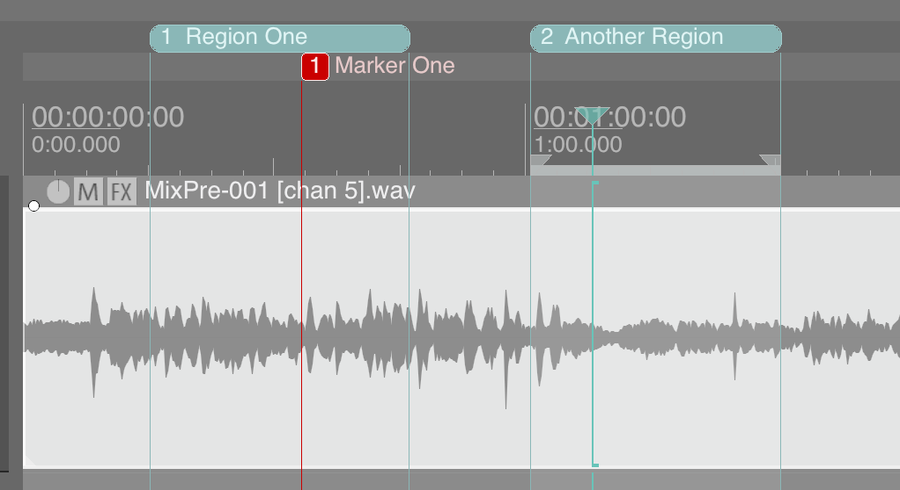
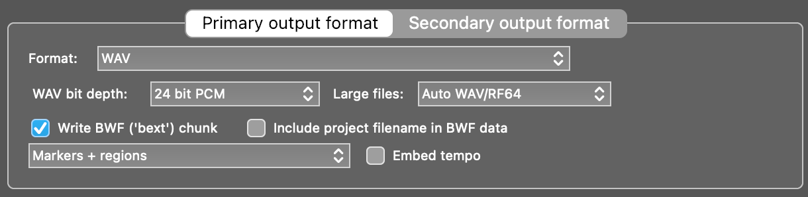

# Reaper Regions
## Read REAPER DAW markers and regions in rendered/exported WAV files
This crate includes both a [library](#reaper-regions-library) and a [CLI](#reaper-regions-cli). The CLI dependencies can be excluded with `default-features = false`.

## REAPER Regions Library

This library parses [REAPER DAW](https://www.reaper.fm/) region markers from WAV files.
It extracts markers, regions, and their associated metadata from
WAV files rendered from REAPER with markers or markers + regions included.
These are stored in RIFF `'cue '`, `'labl'`, and `'smpl'` chunks by REAPER.
In order for this to work properly, two conditions must be met:

1. The project **must** have at least one marker or region defined in the track view:


2. The WAV file **must** be rendered with Regions or Regions + Markers, and there must be at least one marker or region in the time range of the rendered output. The "Write BWF ('bext') chunk" checkbox is **optional** and has no effect on the regions/markers:


This library **might** work with WAV files exported from other DAWs with markers/regions,
but many of them do not support embedding markers or loop regions in exported WAV files.
If you find another DAW whose exports this library can read, please let me know.

### Features
- Parses REAPER region markers and cues from WAV files
- Extracts region names, start/end sample offsets, and start/end times and durations (in seconds)
- Supports both markers (single points) and regions (start/end ranges)
- Provides human-readable and machine-readable output formats

### Supported WAV Chunks
- `cue ` - Cue points with unique IDs and positions
- `labl` - Labels associated with cue points
- `smpl` - Sampler data including loop points
- `LIST` - List chunks containing additional metadata

### Example
```rust
use reaper_regions::parse_markers_from_file;

let data = parse_markers_from_file("path/to/audio.wav").unwrap();
println!("{data:#?}");
```

**Output:**
```rust
WavData {
    path: "tests/fixtures/3-markers-3-regions-overlapping_stripped.wav",
    sample_rate: 48000,
    markers: [
        Marker {
            id: 1,
            name: "Region 1",
            type: Region,
            start: 290708,
            end: Some(
                886374,
            ),
            start_time: 6.056416666666666,
            end_time: Some(
                18.466125,
            ),
            duration: Some(
                12.409708333333334,
            ),
        },
        Marker {
            id: 2,
            name: "Marker 1",
            type: Marker,
            start: 383050,
            end: None,
            start_time: 7.980208333333334,
            end_time: None,
            duration: None,
        },
        Marker {
            id: 3,
            name: "Region 2",
            type: Region,
            start: 1060229,
            end: Some(
                1496290,
            ),
            start_time: 22.088104166666668,
            end_time: Some(
                31.172708333333333,
            ),
            duration: Some(
                9.084604166666665,
            ),
        },
        ...
    ],
    reason: None,
    reason_text: None,
}
```

### Installation
```bash
cargo add reaper-regions --no-default-features
```

### Motivation
I was motivated to create this tool because I needed to sync song regions from my
master mixdown created in REAPER with my video projects in [DaVinci Resolve](https://www.blackmagicdesign.com/products/davinciresolve)
for live concert video and audio productions.
Unfortunately, Resolve does not read markers or regions embedded in WAV files.
Also, the metadata exported by REAPER, as inspected with `ffprobe`, reports
incorrect end times for regions (possibly due to metadata spec limitations?),
necessitating this tool.

### Acknowledgements / License

REAPER is a trademark and the copyright property of [Cockos, Incorporated](https://www.cockos.com/).
This library is free, open source, and MIT-licensed.
DaVinci Resolve is a trademark and the copyright property of [Blackmagic Design Pty. Ltd.](https://www.blackmagicdesign.com/)

License: MIT

---

## REAPER Regions CLI

Command-line interface for extracting Reaper region markers from WAV files.
This tool parses WAV files created with Reaper DAW and outputs markers
and regions in various formats.

### Usage
```bash
reaper-regions audio.wav
reaper-regions audio.wav --format json
reaper-regions audio.wav --format csv --no-header
reaper-regions audio.wav --debug
```

### Output Formats
- Human-readable (default): Easy to read in terminal
- JSON: JavaScript Object Notation
- Delimited, with or without headers, for piping into other programs.
  - CSV: Comma-separated
  - TSV: Tab-separated
  - PSV: Pipe-separated

### Installation
```bash
cargo install reaper-regions
```

### Example JSON output

```json
{
  "markers": [
    {
      "duration": 12.41,
      "end": 886374,
      "end_time": 18.466,
      "id": 1,
      "name": "Region 1",
      "start": 290708,
      "start_time": 6.056,
      "type": "Region"
    },
    {
      "id": 2,
      "name": "Marker 1",
      "start": 383050,
      "start_time": 7.98,
      "type": "Marker"
    },
    {
      "duration": 9.085,
      "end": 1496290,
      "end_time": 31.173,
      "id": 3,
      "name": "Region 2",
      "start": 1060229,
      "start_time": 22.088,
      "type": "Region"
    }, ...
  ],
  "path": "tests/fixtures/3-markers-3-regions-overlapping_stripped.wav",
  "sample_rate": 48000
}
```

### Example PSV output
```rust
type|id|name|start|end|start_time|end_time|duration|sample_rate
region|1|Region 1|290708|886374|6.056|18.466|12.410|48000
marker|2|Marker 1|383050||7.980|||48000
region|3|Region 2|1060229|1496290|22.088|31.173|9.085|48000
```

### Example human output
```rust
File: tests/fixtures/3-markers-3-regions-overlapping_stripped.wav
Sample rate: 48000 Hz
Total markers: 6

Region (ID: 1): 'Region 1'
  Start: 6.056s (290708 samples)
  End: 18.466s (886374 samples)
  Duration: 12.410s (12.409708333333334 samples)

Marker (ID: 2): 'Marker 1'
  Position: 7.980s (383050 samples)

Region (ID: 3): 'Region 2'
  Start: 22.088s (1060229 samples)
  End: 31.173s (1496290 samples)
  Duration: 9.085s (9.084604166666665 samples)
...
```

### Acknowledgements / License

REAPER is a trademark and the copyright property of [Cockos, Incorporated](https://www.cockos.com/).
This library is free, open source, and MIT-licensed.

License: MIT
